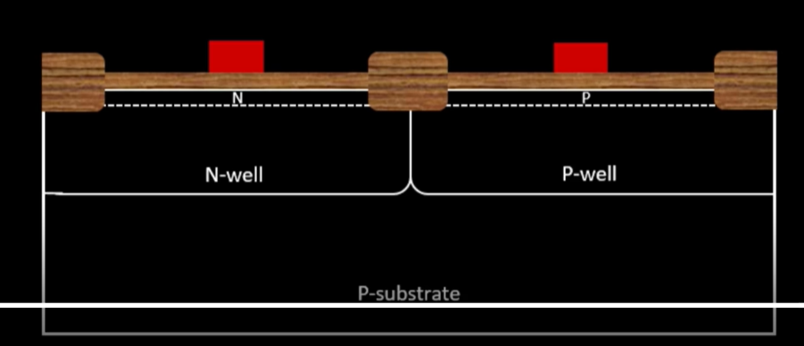
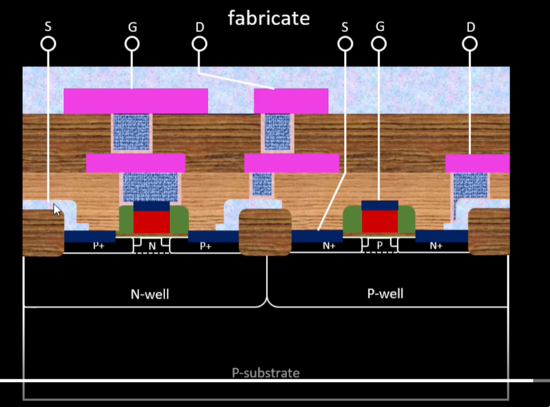

# 16-mask-CMOS-fabrication-process
Documentation of the 16 mask CMOS fabrication process

16 mask CMOS process:
In chip fabrication we first put p substrate then put ~40nm of SiO2 above it followed by Si3N4 above it we put photoresist on top of that we put the mask with required shape. Then on applying UV rays all the regions of photoresist not covered by mask will have chemical reaction which after getting washing will be removed.The remaining area of silicon nitride is etched off and photoresist is also removed. Then the substrate is put in oxidation furnace where the Silicon oxide not covered by Silicon Nitride will grow. \
\
 \
&nbsp;
Substrate with isolation, Silicon nitride, photoresist and mask. \
 \
After UV ray exposure and whasing out the photoresist. \
 \
After Si3N4 is etched off and photoresist removed. \
 \
After it is placed in oxidation furnace to grow silicon oxide layer. \
Then the silicon nitride layer is removed and we will have clear isolation between two mosfet so that they wont communicate. \
For Nwell and Pwell formation we again put photoresist above it and add a mask. \
 \
It is again followed by exposing with UV light and washing out photoresist followed by removal of mask. \
For creating pwell we diffure Boron a P type atom using Ion implantation method. It requires 200keV to penetrate the oxide layer. A similar step is followed for nwell as well with an N type material like Phosphorous. \
 \
After pwell and nwell are formed we need to diffuse the wells deep in the substrate to form clear channel using twon tub process where we put it on a high temperature furnace. Now we are left with something like this: \
 \
After well formation we need to create gates. The parameter of gates are dependent on physical properties of the CMOS that are controlled here. For gate formation we diffuse boron in pwell with low energy to form a thin channel similarly phosphorous for nwell. Diffusion process damages oxide layer so we remove the oxide and again add a new layer of oxide. \
This step is followed by addition of polysilicon layer doping with n type material to reduce gate resistance and addition of photoresist and mask above it then exposure to UV and washing out remains and removal of mask to get polysilicon gate. In this process we controlles Vth using diffusion layer gate oxide capacitance and a low resistance gate formation. \
 \
Lightly doped drain (LDD): \
Here we are using lightly doped N or P type biasing, due to following reason: \
•	Hot electron effect: when device size reduces electric field increases they will have high energy carriers that can break Si-Si bonds and might cross oxide layer \
•	Short channel effect: For short channel drain field can penetrates channel \
Here also we follow standard step of covering Nwell and on exposed Pwell we implant Phosphorous in a manner that it is lighyly dopes (N-) in Pwell. We repease it with Nwell with Boron. \
To protect the newly created LDD we create a side-wall spacer arounf spacer using plasma anisotropic etching process which will also remove oxide layer. They will protect the LDD around the drain when source and drain are created. \
 \ 
**Source and Drain formation:** \
First we need to add a thin layer of oxide to avoid channeling effect where the ion might go to p-subsrtate without crossing wells. The next process is to add a mask aboce N well and add n type in the P well so that the free space will create N+ doping and LDD will be protected by the side wall spacers. It is repeated for N-well by covering P-well. Then it is passed through high temperature annealing to push the source and drain deep into the wells. \
 \
**Metal contact creation:** \
First step is to remove thin oxide layer above the Drain source and gate using HF solution. The contacts are exposed for connection for that we deposit titanuim on wafer surface using sputtering. In sputtering we hit Ti with Ar gas due to which Ti(blue) metal will be emmited out and deposit on wafer surface. \
 \
Titanium deposited is colored blue. \
Next step is to make contact between the Ti deposit and connects. For that waferis heated at 650-700C in N2 atmosphere and it creates contact and TiN formed on other area that is used for local interconnect. \
 \
Now all the drain, sources and gates are connected which might not be required so extra connections are removed by masking and etching is done using RCA cleaning (a solution). \
**Higher level metal formation:** \
 \
For metal interconnection we will have problem with non planar TiN interconnect as shown above. So we need to planarize is by adding a thick layer of oxide layer dopend with P or B. \
 \
After that the rought surfae is planarized by a technique called chemical mechanical polishing (CMP). \
Next to get contacts we create contact hole using mask and standard process discussed above. It is followed by addition of thin layer of TiN that acts like a good adhesion layer of oxide and good barrier layer between top and bottom interconnects. \
 \
It is followed by addition of blanked layer of tungstein to cover the holes created and polish extra tungstein layer using CMP. \
 \
After that to take the tungstein layer to top metal layer we add Aluminion layer above it add a mask follow standard procedude and etch the extra Al metal. 
 \
Now that we have a metal layer above it created to create another metal layer we follow previous procedure of ading Oxide layer, masking it, adding thin TiN layer and tungstein polishing it and then adding new metal layer followed by masking and etching Al metal. \
After we reached top most layer we take add a blanked ot Si3N4 to protect the chip and drill a hole using mask 16. To create pads/bump for the top most pins to communicate with outside world. \
 \
Final fabricated chip.
